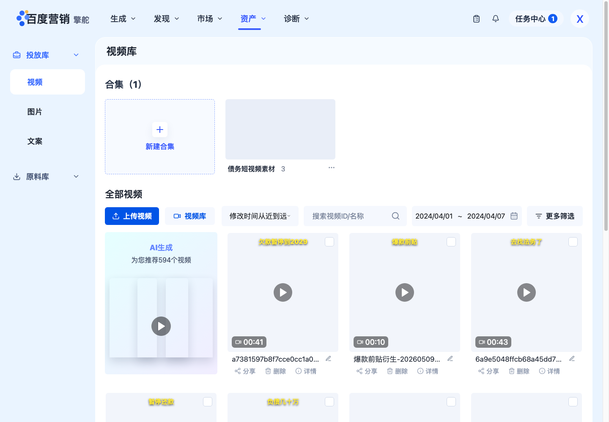
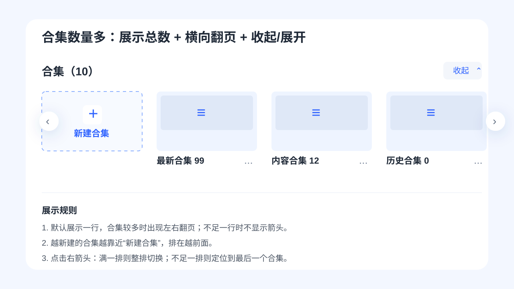
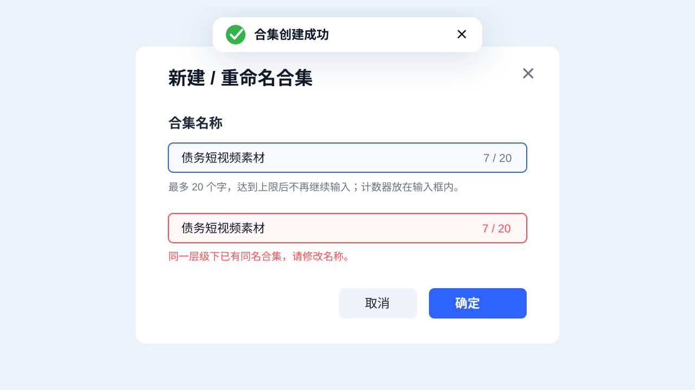
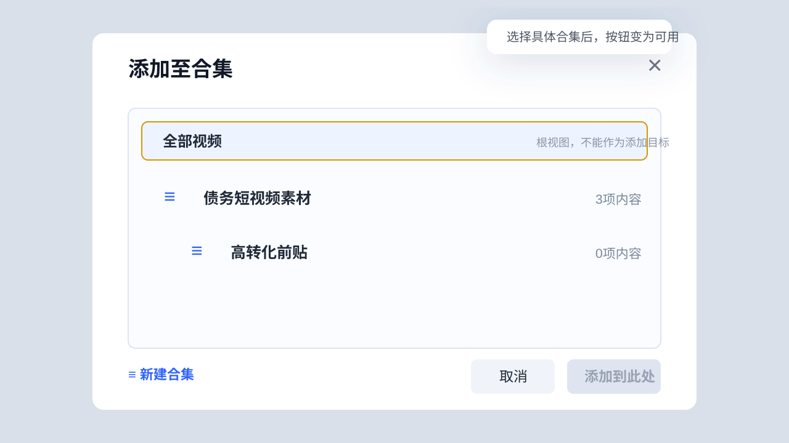
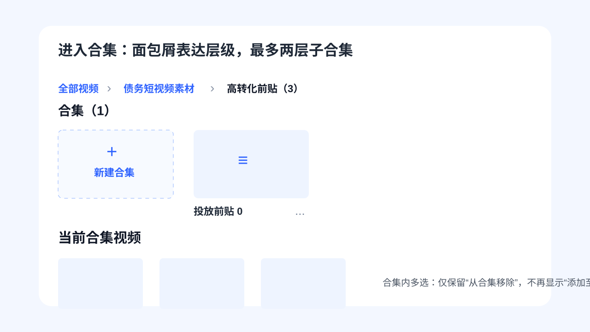
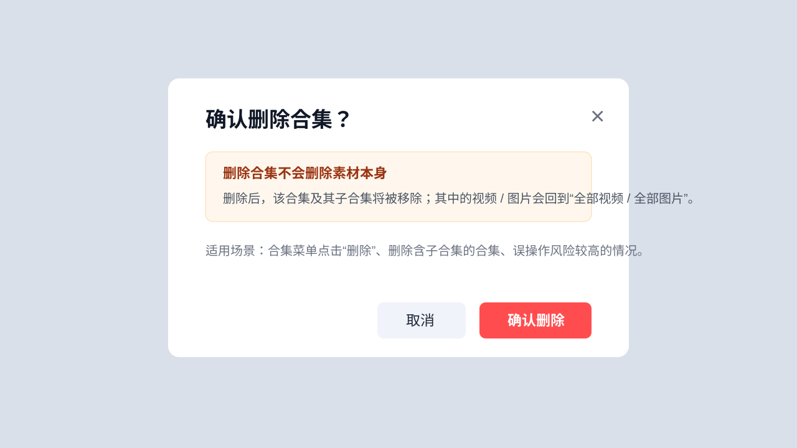
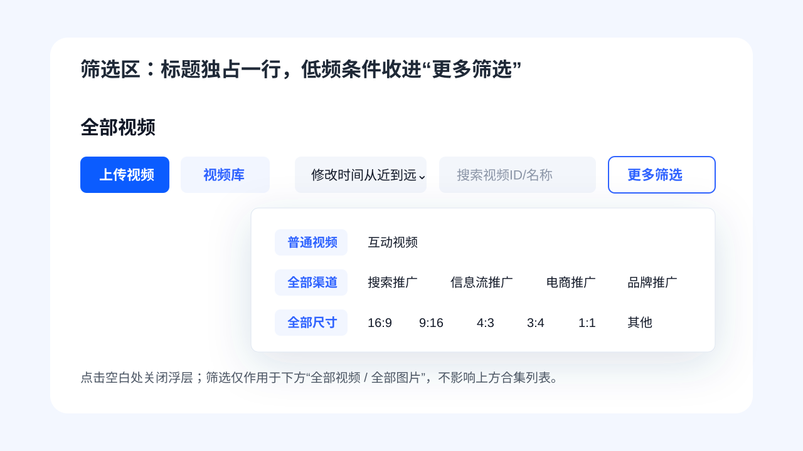
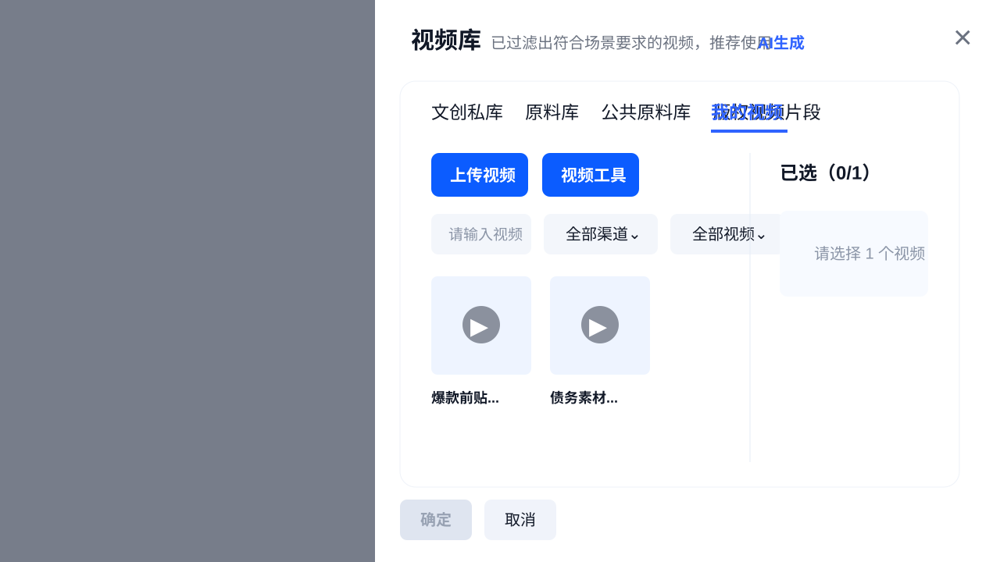

# 资产库合集管理交互状态说明

面向 UI / PM / 前端交接，覆盖投放库视频、投放库图片、原料库视频、原料库图片，以及可被生成链路调用的视频库抽屉。

## 1. 当前页面基准

页面结构保持 2.0 资产库原布局，只做最小升级：

- 顶部仍为资产库页面标题与上传 / 搜索 / 日期等常用操作。
- 合集区域放在素材列表上方，作为独立的归类入口。
- “全部视频 / 全部图片”标题单独占一行，标题下方再放操作与筛选。
- 筛选只作用于下方素材列表，不影响上方合集列表。
- 多选后的批量操作栏保持吸底，不放到右上角。

## 2. 合集数量多

状态说明：

- 合集标题显示总数，例如 `合集（10）`，帮助用户判断当前规模。
- 合集默认展示一行，数量较多时出现左右翻页箭头。
- 点击右箭头时，如果后面满一排，则整排切换；如果不足一排，则定位到最后一个合集。
- 越新建的合集越靠近“新建合集”，排在越前面。
- 不足一行时不展示翻页箭头，避免无效控件。
- 可增加“收起 / 展开”，默认收起为一行，展开后展示更多合集。

极端状态：

- 一级合集最多 10 个，达到上限后禁用新建入口，并提示：`合集数量已达上限，最多可创建10个合集`。
- 子合集最多 11 个，达到上限后禁用新建子合集，并提示：`当前合集下子合集数量已达上限，最多可创建11个子合集`。

## 3. 新建与重命名

状态说明：

- 弹窗标题按场景显示为 `新建合集` 或 `重命名合集`。
- 名称上限为 20 个字，达到 20 个字后不再继续输入。
- 计数器放在输入框内部右侧，例如 `7 / 20`。
- 空名称时，“确定”置灰不可点击。
- 同一层级下不允许重名，提示：`同一层级下已有同名合集，请修改名称。`
- 创建成功后使用成功 Toast，带绿色对勾：`合集创建成功`。
- 长名称在卡片、面包屑、列表中单行省略，hover 后用 Tooltip 展示全量。

## 4. 添加至合集

状态说明：

- “添加至合集”是归类关系，不会让素材从“全部视频 / 全部图片”中消失。
- `全部视频 / 全部图片` 是根视图，不是合集，不能作为添加目标。
- 当默认选中根视图时，右下角 `添加到此处` 置灰。
- 选中具体合集或子合集后，`添加到此处` 才可点击。
- 支持二级子合集，最多两层；选择子合集后，素材加入到该子合集。

## 5. 进入合集与面包屑

状态说明：

- 进入合集后，使用面包屑表达位置：`全部视频 > 一级合集 > 子合集`。
- 面包屑中的上级可点击返回，最后一级为当前合集。
- 当前区域标题显示为 `当前合集视频 / 当前合集图片`。
- 合集内仍可新建子合集，但最多到二级。
- 合集内多选后，只保留 `从合集移除`，不再显示 `添加至合集`，避免 A 合集到 B 合集的复杂转移。

## 6. 删除合集

状态说明：

- 删除合集使用强二次确认弹窗，避免误操作。
- 删除的是合集容器及其子合集，不删除素材本身。
- 弹窗文案建议：`删除后，该合集及其子合集将被移除；其中的视频 / 图片会回到“全部视频 / 全部图片”。`
- 如果用户正在被删除的合集内，删除完成后回到上一级；如果没有上一级，则回到全部素材页。

## 7. 素材删除

需要和“删除合集”区分：

- 在 `全部视频 / 全部图片` 删除素材时，素材会从全部列表和所有合集里同步删除。
- 该操作成本更高，必须使用强二次确认。
- 建议文案：`删除后，该素材将从全部素材及已加入的合集内同步移除，且不可恢复。是否确认删除？`

## 8. 更多筛选

状态说明：

- 低频筛选统一收进 `更多筛选`，减少主页面占用高度。
- 更多筛选浮层点击空白处关闭。
- 投放库 / 原料库视频：常用筛选保留在外部，低频项进入更多筛选。
- 原料库图片：筛选项较少，不需要更多筛选时直接平铺保留。
- 投放库图片：`静态图 / 全部渠道 / 全部来源` 收纳到更多筛选。

## 9. 视频库抽屉

状态说明：

- 视频库抽屉是资产库的缩小版，可嵌入生成链路中调用。
- 点击 `视频库` 按钮后，从右侧滑出抽屉，底层页面加蒙版。
- 抽屉内保留 4 个主要控件：搜索、渠道、视频范围、更多筛选。
- 视频范围下拉包含 `全部视频` 与 `合集视频`；合集视频支持级联选择合集 / 子合集。
- 右侧展示已选内容，单选场景显示 `已选（0/1）`。

## 10. 边界状态清单

| 场景 | 页面表现 | 交互规则 |
| --- | --- | --- |
| 无合集 | 显示 `合集（0）` 和 `新建合集` 卡片 | 用户可直接创建一级合集 |
| 合集很多 | 默认一行展示，出现左右翻页 | 右箭头按整排切换，不足一排定位到末尾 |
| 一级合集达到 10 个 | 新建入口禁用 | Toast：`合集数量已达上限，最多可创建10个合集` |
| 子合集达到 11 个 | 新建子合集禁用 | Toast：`当前合集下子合集数量已达上限，最多可创建11个子合集` |
| 名称为空 | 确定按钮置灰 | 不允许提交 |
| 名称 20 字 | 输入停止，计数 `20 / 20` | 不再继续输入 |
| 名称重复 | 输入框报错 | 同一层级不允许重名 |
| 长名称 | 单行省略 | hover 展示 Tooltip |
| 空合集 | 预览区显示空态图标，数量为 0 | 可进入、重命名、删除 |
| 删除合集 | 强确认弹窗 | 素材回到全部，不删除素材 |
| 删除素材 | 强确认弹窗 | 素材从全部和合集同步删除 |
| 版权图片 | 上方合集正常展示 | 版权图片批量操作不显示添加至合集 |

## 11. UI 需要重点确认

- 合集卡片：空态、1 张图、2 张图、3 张及以上拼图规则。
- 合集总数、素材数量、长名称 Tooltip 的样式。
- 左右翻页箭头、收起 / 展开按钮的视觉位置。
- 新建 / 重命名输入框：20 字计数器放在输入框内部。
- 成功 Toast：绿色对勾样式。
- 删除合集、删除素材两类强确认弹窗的主按钮样式。
- 视频库抽屉在不同页面嵌入时的宽度、蒙版与底部按钮区域。

## 12. 前端实现注意

- 合集是归类关系，不是移动关系；添加至合集后素材仍在全部列表。
- 合集删除只删除合集关系，不删除素材。
- 素材删除会同步清除所有合集内的引用关系。
- 合集上限建议抽成常量：一级 `10`，子级 `11`，名称 `20`。
- 筛选状态只影响素材列表，不影响合集区域。
- 当前原型为前端 mock，刷新后恢复初始数据。
